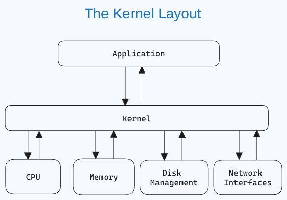

# Linux for Beginners

- Linux can help you get things done faster and more efficiently.
- Many of the world's powerful servers and supercomputers run on Linux.

# Table of Contents

- [Part 1: Introduction to Linux](#part-1-introduction-to-linux)

  - [1.1. Getting Started with Linux](#11-getting-started-with-linux)

- [Part 2: Introduction to Bash Shell and System Commands](#part-2-introduction-to-bash-shell-and-system-commands)

  - [2.1. Getting Started with the Bash shell](#21-getting-started-with-the-bash-shell)
  - [2.2. Command Structure]()
  - [2.3. Bash Commands and Keyboard Shortcuts]()
  - [2.4. Identifying Yourself: The whoami Command]()

- [Part 3: Understanding Your Linux System]()

  - [3.1. Discovering Your OS and Specs]()

- [Part 4: Managing Files From the Command line]()

  - [4.1. The Linux File-system Hierarchy]()
  - [4.2. Navigating the Linux File-system]()
  - [4.3. Managing Files and Directories]()
  - [4.5. Basic Commands for Viewing Files]()

- [Part 5: The Essentials of Text Editing in Linux]()

  - [5.1. Mastering Vim: The Complete Guide]()
  - [5.2. Mastering Nano]()

- [Part 6: Bash Scripting]()

  - [6.1. Definition of Bash scripting]()
  - [6.2. Advantages of Bash Scripting]()
  - [6.3. Overview of Bash Shell and Command Line Interface]()
  - [6.4. How to Create and Execute Bash scripts]()
  - [6.5. Bash Scripting Basics]()

- [Part 7: Managing Software Packages in Linux]()

  - [7.1. Packages and Package Management]()
  - [7.2. Installing a Package via Command Line]()
  - [7.3. Installing a Package via an Advanced Graphical Method – Synaptic]()
  - [7.4. Installing downloaded packages from a website]()

- [Part 8: Advanced Linux Topics]()

  - [8.1. User Management]()
  - [8.2 Connecting to Remote Servers via SSH]()
  - [8.3. Advanced Log Parsing and Analysis]()
  - [8.4. Managing Linux Processes via Command Line]()
  - [8.5. Standard Input and Output Streams in Linux]()
  - [8.6 Automation in Linux – Automate Tasks with Cron Jobs]()
  - [8.7. Linux Networking Basics]()
  - [8.8. Linux Troubleshooting: Tools and Techniques8.9. General Troubleshooting Strategy for Servers]()

- [Conclusion]()

# Part 1: Introduction to Linux

## 1.1. Getting Started with Linux

### What is Linux?

Linux is an **open-source operating system** that is based on the Unix operating system. It was created by _Linus Torvalds_ in _1991_.

Open source means that the source code of the operating system is freely available to the public. This allows anyone to modify the original code, customise it, and distribute the new operating system to potential users.

Linux is primarily open source, which means that its source code is freely available. Anyone can view, modify, and distribute it. Developers from anywhere in the world can contribute to its improvement. This lays the foundation of collaboration which is an important aspect of open source software.

This collaborative approach has led to the widespread adoption of Linux across servers, desktops, embedded systems, and mobile devices.

The most interesting aspect of Linux being open source is that anyone can tailor the operating system to their specific needs without being restricted by proprietary limitations.

Chrome OS used by Chromebooks is based on Linux. Android, that powers many smartphones globally, is also based on Linux.

### What is a Linux Kernel?

The `kernel` is **the central component of an operating system that manages the computer and its hardware operations**. It _handles memory operations_ and _CPU time_.

The kernel **acts as a bridge between applications and the hardware-level data processing** using _inter-process communication_ and _system calls_.

The kernel _loads into memory first when an operating system starts_ and remains there until the system shuts down. It is responsible for tasks like disk management, task management, and memory management.

   

### What is a Linux distribution?

A Linux distribution or distro is a version of the Linux operating system that includes the Linux kernel, system utilities, and other software. Being open source, a Linux distribution is a collaborative effort involving multiple independent open-source development communities.

**What does it mean that a distribution is derived?**

When you say that a distribution is "derived" from another, the newer distro is built upon the base or foundation of the original distro. This derivation can include using the same package management system (more on this later), kernel version, and sometimes the same configuration tools.

Distributions vary from one to the other, but they generally have several common characteristics:

- A distribution consists of a Linux kernel.
- It supports user space programs.
- A distribution may be small and single-purpose or include thousands of open-source programs.
- Some means of installing and updating the distribution and its components should be provided.

Two major distros: Slackware and Debian. Several distributions are derived from them. For example, Ubuntu and Kali are derived from Debian.

**What are the advantages of derivation?**

There are various advantages of derivation. Derived distributions can leverage the stability, security, and large software repositories of the parent distribution.

When building on an existing foundation, developers can drive their focus and effort entirely on the specialized features of the new distribution. Users of derived distributions can benefit from the documentation, community support, and resources already available for the parent distribution.

Some popular Linux distributions are:

- `Ubuntu`: One of the most widely used and popular Linux distributions. It is user-friendly and recommended for beginners.

- `Linux Mint`: Based on Ubuntu, Linux Mint provides a user-friendly experience with a focus on multimedia support.

- `Arch Linux`: Popular among experienced users, Arch is a lightweight and flexible distribution aimed at users who prefer a DIY approach.

- `Manjaro`: Based on Arch Linux, Manjaro provides a user-friendly experience with pre-installed software and easy system management tools.

- `Kali Linux`: Kali Linux provides a comprehensive suite of security tools and is mostly focused on cybersecurity and hacking.

### Why should you learn about Linux?

In today's data center landscape, Linux and Microsoft Windows stand out as the primary contenders, with Linux having a major share.

- Given the prevalence of Linux hosting, there is a **high chance that your application will be hosted on Linux**. So learning Linux as a developer becomes increasingly valuable.

- With cloud computing becoming the norm, chances are high that **your cloud instances will rely on Linux.**

- Linux serves as the **foundation for many operating systems for the Internet of Things (IoT)** and **mobile applications**.

- In IT, there are many opportunities for those skilled in Linux.

# Part 2: Introduction to Bash Shell and System Commands

## 2.1. Getting Started with the Bash shell

### Introduction to the bash shell
